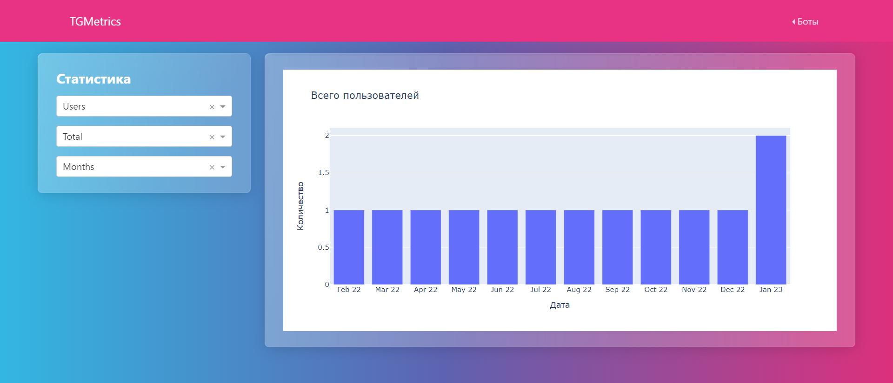

<h1 align="center">TGMetrics</h1>
<h4 align="center">Dash (Flask) web app for Telegram bot statistics.</h4>

  <a href="TODO.md">TODO</a> •
  <a href="#contributing">Contributing</a> •
  <a href="#license">License</a>

    

    

## Contributing

Bug reports and/or pull requests are welcome

## License

The module is available as open source under the terms of the [Apache License, Version 2.0](https://opensource.org/licenses/Apache-2.0)
